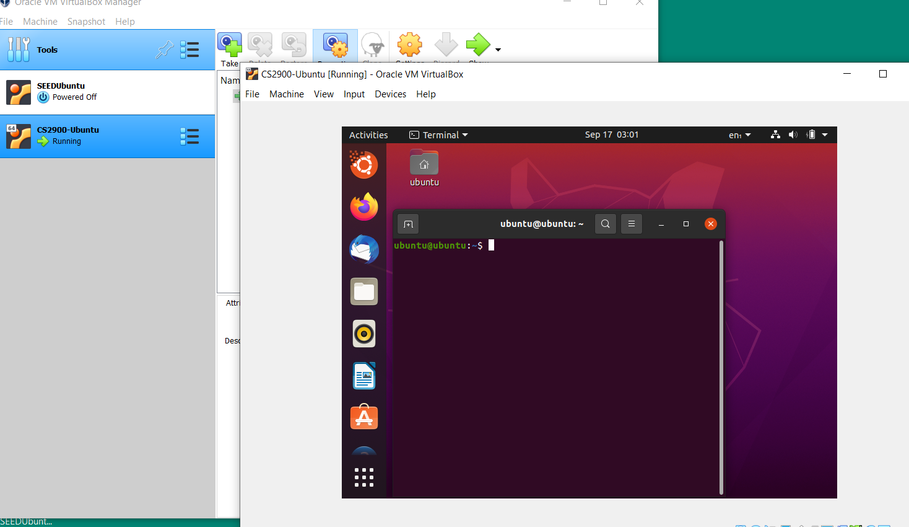

# Project 1 Documentation

## Part 1 - Building VMMs
### Set up the Guest OS (Ubuntu) on my Host (Windows 10) 
- Install a Virtual Machine Software
    - Virtual Box
- Download an ISO (machine image)
    - 20.04.3-desktop-amd64.iso 
    - Link to [Download Ubuntu](https://ubuntu.com/download/desktop)
- Launch VM VirtualBox
    - Click "New" to create VM
        - Set up a name 
        - Machine Folder
        - Type: Linux
        - Version: Ubuntu 
        - Memory size: 4 GB
        - Disk space reserved: 16 GB
            - Create a Virtual Hard Disk: VDI (VirtualBox Disk Image)
            - I choose to do a fixed disk space, I do not want it to be daynamicallt allocated. Because this VM is only for my class work and I donot want it takes me too much space.
- Start up my Ubuntu VM
    - Select start-up disk
        - Choose a virtual optial disk file
        - Add 20.04.3-desktop-amd64.iso 
        - Click "Start"
- Image of my running Ubuntu

- 3D acceleration
    - 3D acceleration in a VM gives VM a virtual GPU.
    - I am not allow 3D acceleration I am using this VM only for class work,so 3D acceleration isn't really needed for me.
- Benefit of installing Guest Additions
    - Provide additional capability to guest virtual machine, like file sharing. Ability to interface better with system hardware, like connect to a USB drive from my guest VM that is attached to my host. 
- Install Guest Additions for VirtualBox
    - Download guest additions 
    - Link to [Download VirtualBox Guest additions](https://www.virtualbox.org/wiki/Downloads)
    - Open VirtualBox -> click File -> Preferences -> Select Extensions -> Click "Plus Sign" to add package file I download -> Hit "Install" 
    - Open the mounted disk in the VM
    - Run VBoxLinuxAdditions.run
        - Open Terminal
        - `cd` to the position VboxLinuxAdditions.run located.
        - check the permission of VboxLinuxAdditions.run
        - `sudo sh ./VboxLinuxAdditions.run`
- Enable USB Controller in VM
    - Click Settings -> Select one USB Drive -> Save and Exit
    - Launch VM -> Under Devices -> USB

## Part 2 - Exploring Virtualization
## Part 3 - Networking with style