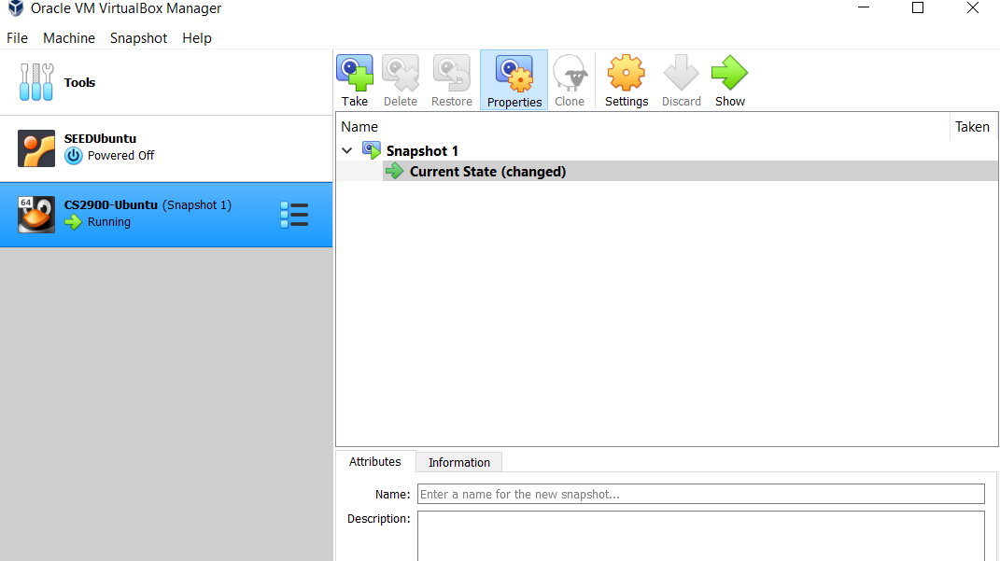
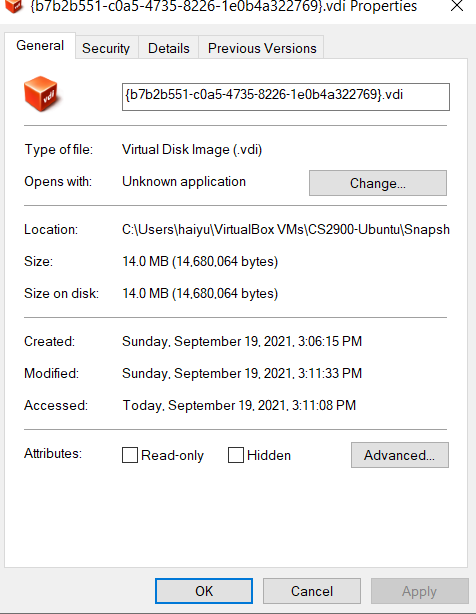
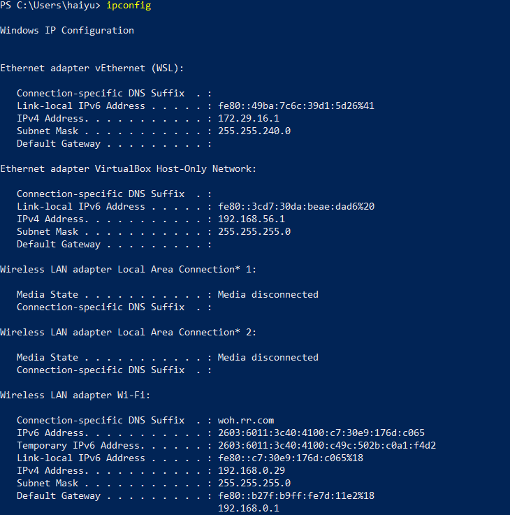
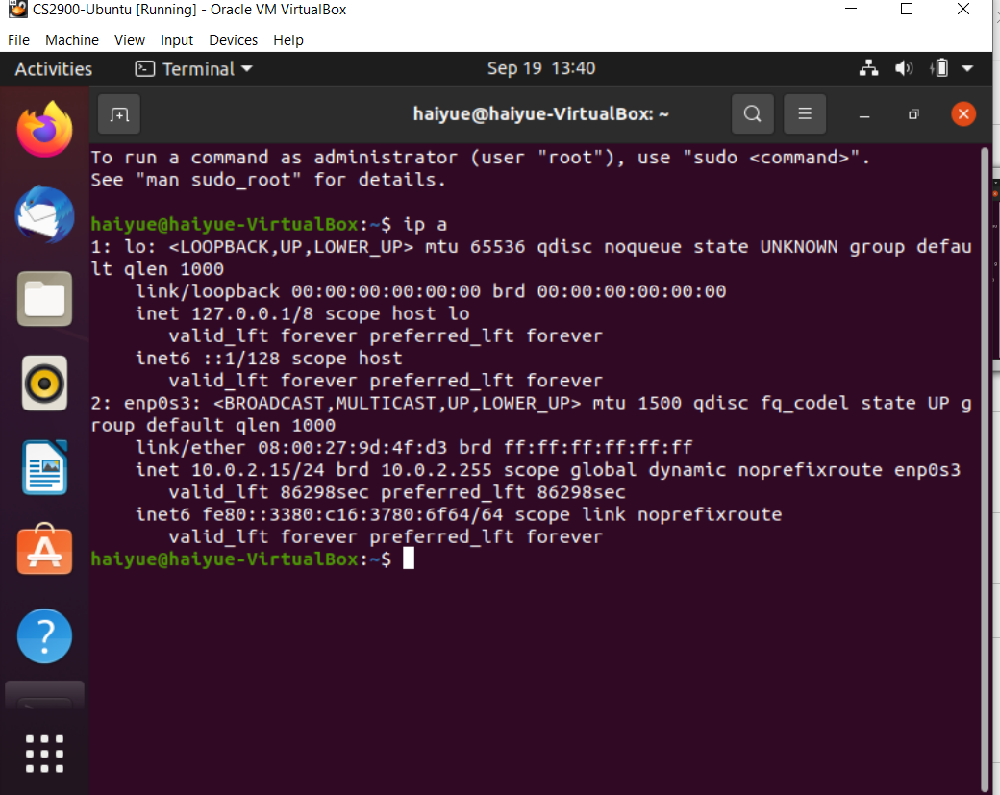
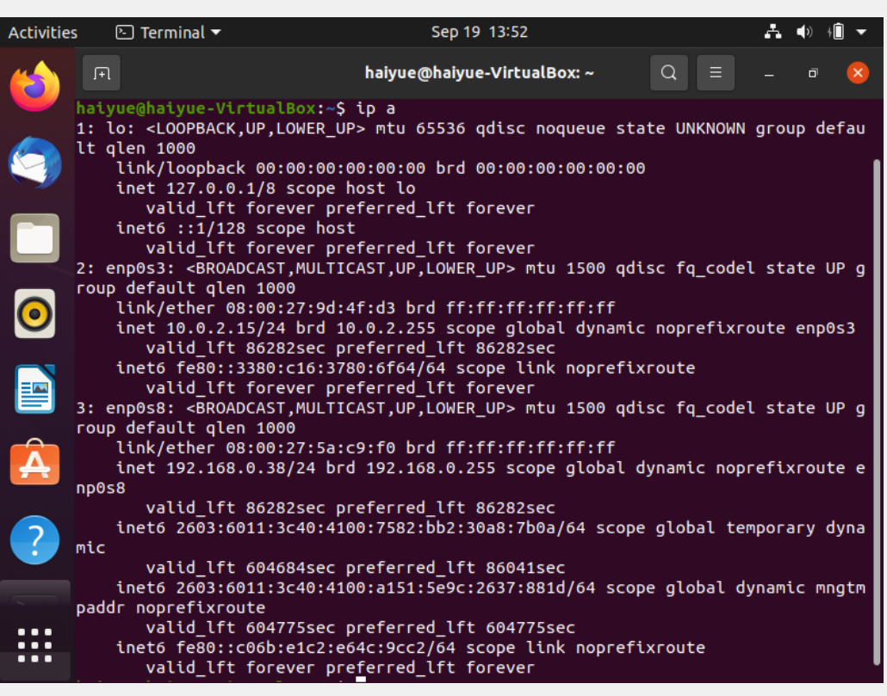
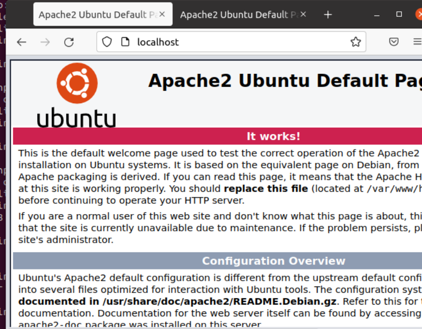
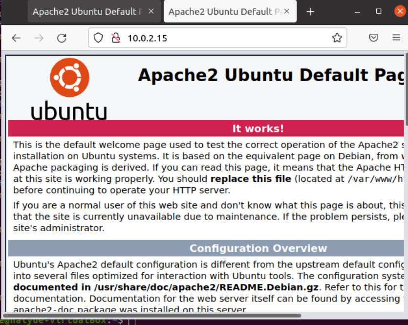
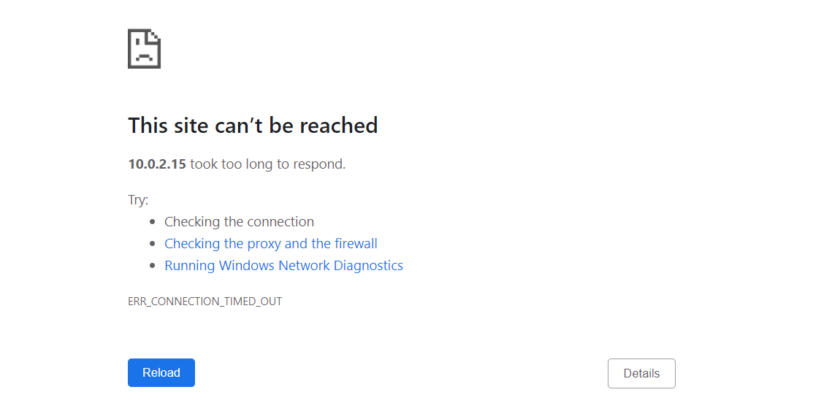
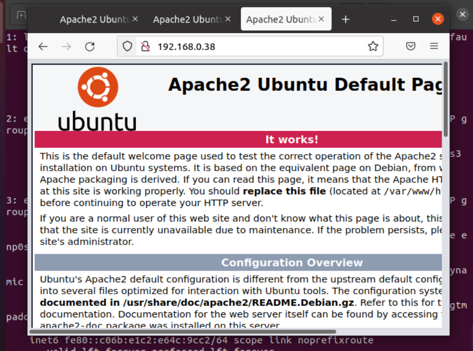
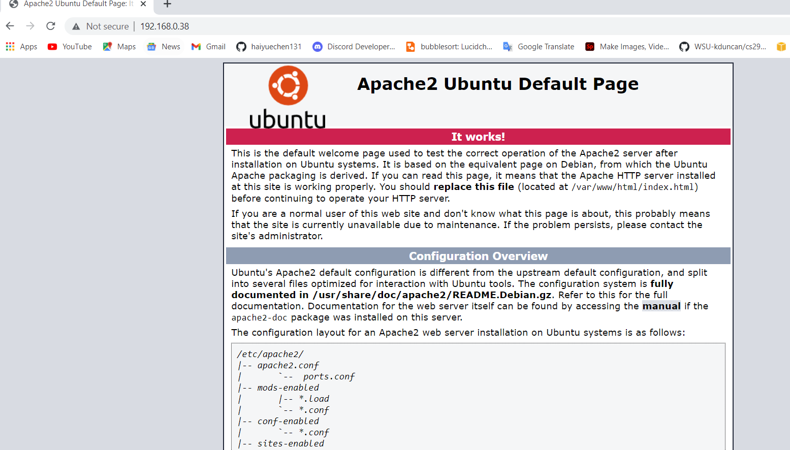

# Project 1 Documentation

## Part 1 - Building VMMs
### Set up the Guest OS (Ubuntu) on my Host (Windows 10) 
- Install a Virtual Machine Software
    - Virtual Box
- Download an ISO (machine image)
    - 20.04.3-desktop-amd64.iso 
    - Link to [Download Ubuntu](https://ubuntu.com/download/desktop)
- Launch VM VirtualBox
    - Click "New" to create VM
        - Set up a name 
        - Machine Folder
        - Type: Linux
        - Version: Ubuntu 
        - Memory size: 4 GB
        - Disk space reserved: 16 GB
            - Create a Virtual Hard Disk: VDI (VirtualBox Disk Image)
            - I choose to do a fixed disk space, I do not want it to be daynamicallt allocated. Because this VM is only for my class work and I donot want it takes me too much space.
- Start up my Ubuntu VM
    - Select start-up disk
        - Choose a virtual optial disk file
        - Add 20.04.3-desktop-amd64.iso 
        - Click "Start"
- Image of my running Ubuntu

- 3D acceleration
    - 3D acceleration in a VM gives VM a virtual GPU.
    - I am not allow 3D acceleration I am using this VM only for class work,so 3D acceleration isn't really needed for me.
- Benefit of installing Guest Additions
    - Provide additional capability to guest virtual machine, like file sharing. Ability to interface better with system hardware, like connect to a USB drive from my guest VM that is attached to my host. 
- Install Guest Additions for VirtualBox
    - Download guest additions 
    - Link to [Download VirtualBox Guest additions](https://www.virtualbox.org/wiki/Downloads)
    - Open VirtualBox -> click File -> Preferences -> Select Extensions -> Click "Plus Sign" to add package file I download -> Hit "Install" 
    - Open the mounted disk in the VM
    - Run VBoxLinuxAdditions.run
        - Open Terminal
        - `cd` to the position VboxLinuxAdditions.run located.
        - check the permission of VboxLinuxAdditions.run
        - `sudo sh ./VboxLinuxAdditions.run`
- Enable USB Controller in VM
    - Click Settings -> Select one USB Drive -> Save and Exit
    - Launch VM -> Under Devices -> USB

## Part 2 - Exploring Virtualization
### Exploring Host Disk Usage
- To find where my VM folder locates in my Windows10
    - Launch VirtualBox -> Select my CS2900-Ubuntu -> Click Settings -> Seclect General -> Click Advanced. 
    - Under Advanced, I can see the folder path for my VM.
    - It takes 15GB spaces. 
    - Can you directly access your Guest files from the virtual machine image folder? 
        - No
    - To transfer Files Between a Virtual Machine Guest and Host PC
        - USB drive
        - Shared Folder
            - Launch VirtualBox -> open Devices -> Shared Folders -> Shared Folders Settings
            - Click Plus Sign -> in Folder Path, click the arrow and select Other
            - Select the folder(the host) you're using

In the Add Share window, give the share a name (keeping the same name in the guest OS as the host OS is wise). Check Auto-mount and Make permanent, then OK.
- Snapshots vs. Templates 
- Snapshots
    - It captures the entire state of the VM at a given point in time, includes:
        - The state of all the VM's disks.
        - The contents of the VM's memory
         - VMesettings
    - It provide a change log for the virtual disk 
    - Can use to restore a VM to a particular point in time when a system error occurs.
#### Sceenshot of a snapshot

#### Disk space of my snapshot

- Templates
    - A master copy image of a VM can be used to create many clones, includes 
        - VM disks
        - Virtual devices 
        - Settings

### Exploring Guest Networking
- Network configuration for my Host
    - I have one Mac laptop, one HP laptop and my iphone at my home
    - Each of these devices request an private ip address from my router
    - NAT(Network Address Traslation) lets my router to assign private address to a public address
    - Use the `ipconfig` command to view Advanced configuration settings

- Network configuration for my Guest
    - Use the `ip a` command to view my VM network configuration settings  

- the hypervisor manages virtualized networking devices for my Guest to connect to the outside world
- NAT Mode(default for guest on hosts)
    - The VM obtains a private IP address from the DHCP server upon starting up, and the VMM maps this address to a TCP port number on the host machine. 

## Part 3 - Networking with style
### Bridged networking
- It provides a solution allows my VM to be exposed to the external network the host machine connects to. 
    - My VM can request an IP from a DHCP server. 
    - To enable Bridaged Adapter
        - VM settings -> Network - Adapter2 -> Select Enable Network Adapter -> Hit OK

- Example of Bridged networking mode
    - installed a web server and accessing it from the different IP configured on my host and guest
    - To install apache2
        - `sudo apt install apache2`
#### Accessing apache2 webserver from localhost on my VM

#### Accessing apache2 webserver from 10.0.2.15(NAT) on my VM

#### Accessing apache2 webserver from 10.0.2.15(NAT) on my Host  

#### Accessing apache2 webserver from 198.168.0.38(Bridaged) on my VM

#### Accessing apache2 webserver from 198.168.0.38(Bridaged) on my Host
