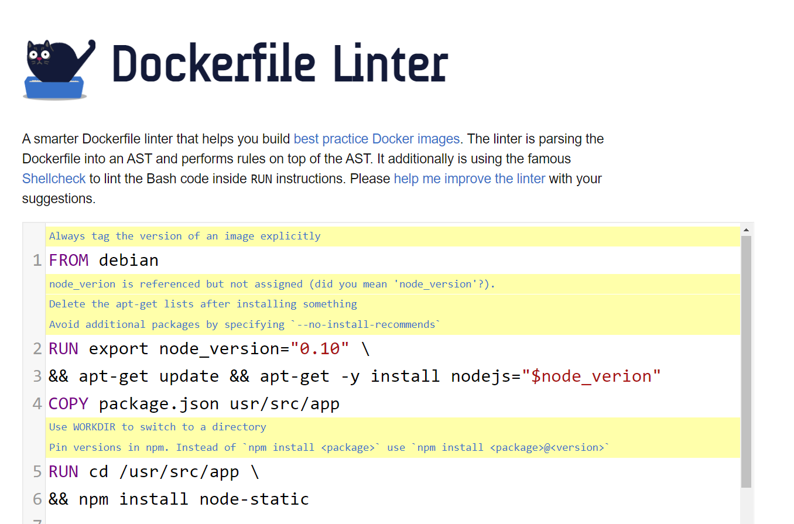
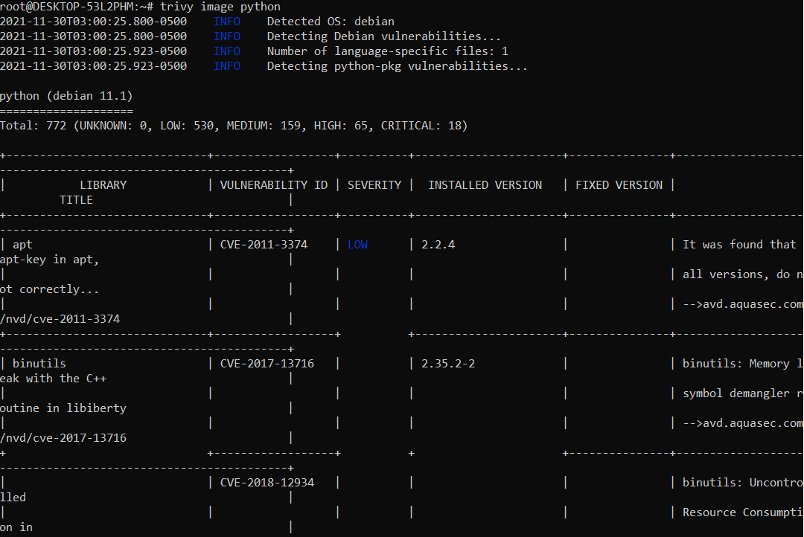
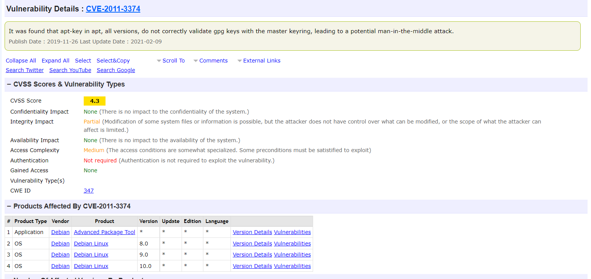

# Project 4 Documentation

## Container engine 1: Docker
### Investigate container networking 
- What networking mode(s) are supported and their capabilities
    - `-- network host`: Docker does not use the network namespace isolation, containers work in the root network namespace and share the network stack with the host machine
    - `--network none`: fully isolated namespace, no route
    - `--network bridge`: network namespace is not shared, a bridge network uses a software bridge which allows containers connected to the same bridge network to communicate, while providing isolation from containers which are not connected to that bridge network.  
- What networking mode is used by default
    - bridge
- How to run the container and bind a host port to the container port
    - `docker run -p HOST_PORT:CONTAINER_PORT image_name`
    - `-p`:Create a port mapping rule like `-p ip:hostPort:containerPort` maps a container port to a port on the Docker host to the outside world.  

## Container engine 1: Podman
### Investigate container networking 
- What networking mode(s) are supported and their capabilities
    - bridge : Creates a network stack on the default bridge network allowing the containers to communicate outside of the host 
    - none: No networking is set up at all
    - host: Use the host's network stack
    - slirp4netns: Creates a user network stack with slirp4netns (This is the default option for rootless containers.)
- What networking mode is used by default
    - bridge 
- How to run the container and bind a host port to the container port
    - Podman's approach to rootful networking is very close to docker. But when it comes to rootless containers, podman relies on slirp4netns
    - Use the host network to access the container’s port from the host
        - Example: `podman run --network=host nginxinc/nginx-unprivileged`
        - use `podman run` to run a process in a new, rootless container, and `--network=host` to attach it to the host network
        - The Nginx webserver is now running on port 8080 inside a container.
    - Communicate between a rootless container and the host
        - `podman run -dt --rm -P image_name` 
    - Communicate between a rootfull container and the host
        - `podman run -dt --rm --publish-all image_name`
        - `podman port -l` to check the ports published and occupied
        - `curl http://localhost:port_number`
- Reference Link: https://www.tutorialworks.com/podman-host-networking/
- Reference Link: https://podman.io/getting-started/network
- Reference Link: https://www.redhat.com/sysadmin/container-networking-podman

## Investigate vulnerability scanners
- Dockerfile Linter
    - Best Practices
        - Use absolute WORKDIR.
        - For some bash commands it makes no sense running them in a Docker container like ssh, vim, shutdown, service, ps, free, top, kill, mount, ifconfig.
        - Last user should not be root.
        - Do not use sudo as it leads to unpredictable behavior.  
        - Always tag the version of an image explicitly.
        - Use COPY instead of ADD for files and folders.
        - Use only an allowed registry in the FROM image
        - More on: https://github.com/hadolint/hadolint
        - Example:
        - 

- Trivy
    - Trivy scan images to detect vulnerabilities
    - `trivy image [YOUR_IMAGE_NAME]`
    - Scan results are showing up to the terminal. The table provides a full list of issues, including the library each one was found in, a description, and a CVE ID when available.
    - CVE(Common Vulnerabilities and Exposures): is a list of publicly disclosed computer security flaws. 
        - Search for details for a specific CVE ID: https://www.cvedetails.com/
    - Example:
    - 
    - 
